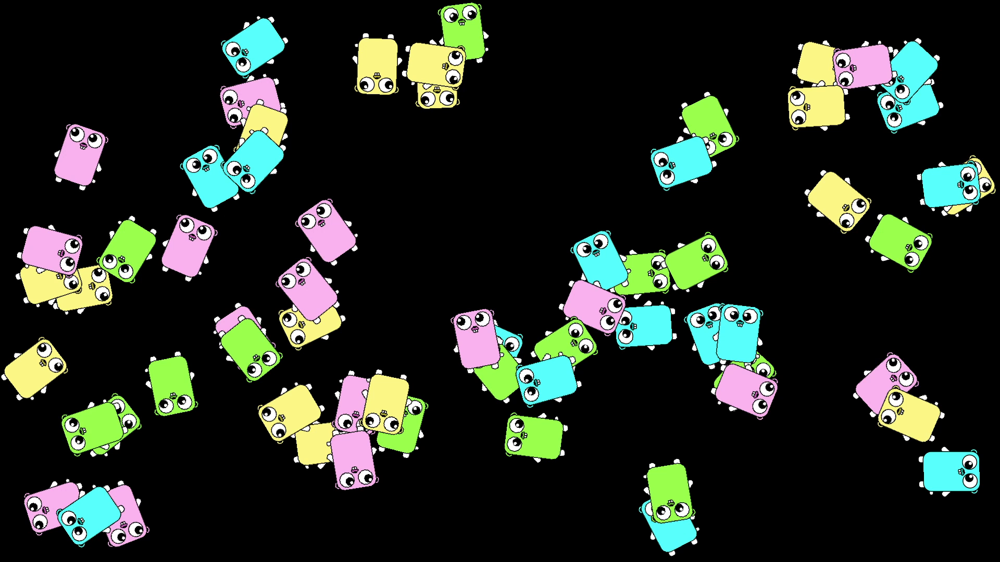

<!-- -*- encoding: utf-8 -*- -->

ebiten\_fulscreen\_sample
=========================

Go言語(golang)で2Dゲームを作成できるEbitengineでフルスクリーン表示をするサンプル

Description / 説明
------------------

Go言語(golang)で2Dゲームを作成できるEbitengineで、フルスクリーン表示ができるか試してみました。

Windows11 x64 25H2上でのみ動作します。多重起動禁止処理にWin32 API の Mutex を使っているためWindows以外では動作しません。

Screenshots / スクリーンショット
--------------------------------




Requirement / 依存関係
----------------------

* Go 1.25.7 64bit
* Ebitengine 2.9.8
* go-winres : リソースファイルを変換する際に使用
* task (taskfile) : ビルド手順を実行する際に使用

Environment / 動作確認環境
--------------------------

* Windows11 x64 25H2 でのみ動作確認。

Usage / 使い方
--------------

* `fullscreen_sample.exe` をダブルクリックするとフルスクリーン表示で画像を表示します。
* 実行するたびに、ランダムで表示される画像が変わります。
* 何かのキーを押すか、マウスボタンをクリックするか、マウスを移動すると終了します。

ビルドの仕方
------------

リソースファイルの変換に go-winres が必要です。Go がインストールしてある環境で以下を打ってインストールしてください。

```
go install github.com/tc-hib/go-winres@latest
```

ビルド手順の実行には task が必要です。Go がインストールしてある環境で以下を打ってインストールしてください。

```
go install github.com/go-task/task/v3/cmd/task@latest
```

go-winres と task がインストールできたら、以下を打てばビルドできます。.exe が生成されます。

```
task build
```

### Goを使ったプロジェクトのビルドについての説明

1. ソースコードのあるディレクトリで、`go mod init アプリ名` と打ちます。依存関係が記述される go.mod ファイルが作成されます。
2. `go mod tidy` と打てば、ソースコードに基づいて go.mod の内容が変更されて、必要なライブラリ/パッケージが自動でダウンロードされます。
3. `go-winres init` でリソースファイルの元になる記述ファイルを作成できます。
   * winres/ が作成され、winres.json と icon*.png が作成されます。
   * プロジェクトに合わせた内容に修正したり、アイコン画像を変更できます。
4. `go-winres make` でリソースファイル(.syso)を作成します。winres/winres.json の記述に基づいて .syso が生成されます。
5. `go build -ldflags="-H windowsgui"` と打って、Goを使ってビルドして .exe を作成します。
   * `go mod init アプリ名` で指定した際のアプリ名が使われて、`アプリ名.exe` が生成されます。
   * `-ldflags="-H windowsgui"` の指定はGUIアプリを作成するための指定で、コンソール非表示の指定です。

画像について
------------

以下の画像を使用しています。source_images/ 以下を参照のこと。

* 自作画像。
* Go言語の公式マスコット Go gopher の画像。
* AI(Microsoft Copilot, Google NanoBanana) で生成した画像。

Author / 作者名
---------------

[mieki256](https://github.com/mieki256)

